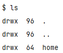

# 文件管理实验

# 一、实验目的

通过用高级语言编写和调试一个简单的文件系统，模拟文件管理的工作过程。从而对各种文件操作命令的实质内容和执行过程有比较深入的了解。

# 二、实验内容和要求

编程模拟一个简单的文件系统，实现文件系统的管理和控制功能。要求文件系统采用两级目录，即设置主文件目录[MFD]和用户文件目录[UFD]。

另外，为打开文件设置运行文件目录[AFD]。并设计**一个N用户的文件系统，每次用户可保存M个文件，用户在一次运行中只能打开一个文件**，对文件必须设置保护措施，且至少有：

1. Create
2. Delete
3. Open
4. Close
5. Read
6. Write

等命令。

1. 设计一个10个用户的文件系统，每次用户能保存10个文件，一次运行用户可以打开5个文件。
2. 要求文件系统采用两级目录，即设置主文件目录[MFD]和用户文件目录[UFD]。另外，为打开文件设置运行文件目录[AFD]。

|MFD|
| --------------|
|用户名|
|文件目录指针|
|用户名|
|文件目录指针|

|UFD|
| ----------|
|文件名|
|保护码|
|文件长度|
|文件名|

|AFD|
| ------------|
|打开文件名|
|打开保护码|
|读写指针|

3. 假定系统提供了6条命令：Create, Delete, Open, Close, Read, Write.
4. 实验方法

    1. 因为系统小，文件目录的检索使用了简单的线性搜索
    2. 为了便于实现，对文件的读写做了简化，在执行读写命令时，只需改读写指针，并不进行实际的读写操作。其中，读写指针用来指出对文件的存取位置。初始状态下，读指针=0，写指针=文件长度，文件长度=0.
    3. 文件使用了三位保护码：1表示文件允许读；2表示文件允许写；3表示文件可执行
    4. 创建文件时，通过模拟磁盘的使用情况来实现。

# 三、实验设计及原理

## 开发环境

* 语言环境：C++
* IDE：vscode使用ssh远程连接Ubuntu（Linux系统）虚拟机开发。

## 文件系统的磁盘布局

本实验通过分割一个正常的文件，模拟一个磁盘，并且只允许使用准备好的接口来读写。

​​

**设定每一个Block的大小为：4KB**

1. SuperBlock：数量为1，在整个文件最开头的那个Block
2. InodeBlocks：假设整个磁盘有n个Block，那就会拿出n的十分之一来充当InodeBlock
3. DataBlock：除去SuperBlock和InodeBlock，剩下的就是DataBlock

### SuperBlock的构成

1. **Magic**：第一个字段总是一个魔数`0xf0f03410`​。如果格式化了磁盘，那魔数就会被放到第一个字段中，作为文件系统的一个“签名”。当需要挂载该磁盘时，操作系统就会查看这个魔数。如果它是`0xf0f03410`​，该磁盘就会被假定为一个有效的文件系统；如果不是，那就会挂载失败，有可能是磁盘没有格式化或者包含了其他类型的数据。
2. **Blocks**：磁盘中Block的总数
3. **InodeBlocks**：用于存储索引结点Inode的块数，这里设置成磁盘Block总数的十分之一
4. **Inodes**：Inode的总数

以上四个字段各占4个字节。

### Inode的构成

​​

1. **Valid**：为1，代表该Inode是有效的；为0，代表该Inode是空闲的
2. **Size**：Inode管理的DataBlock的逻辑大小，比如说：Inode占用了2个DataBlock（每个4KB），但只用了6KB的空间，那Size就是6KB。
3. **Direct[0 ... .4]** ：DataBlock的直接指针，直接指向一个DataBlock。
4. **Indirect**：DataBlock的二级指针，也就是说Indirect指向一个DataBlock，这个DataBlock的元素全部都是执行DataBlock的一级指针。

一个Inode最大可以存储的文件大小为：4KB * 4 + 1024 * 4KB = 16KB + 4MB

## 磁盘管理程序

为了方便文件系统进行挂载、读写、查看磁盘的状态等操作，需要编写一套接口简化文件系统的程序设计。

使用基于对象的程序设计思想，将这套接口封装成一个类对象。

```C++
class Disk {
private:
    int	    FileDescriptor; // 磁盘文件的文件描述符
    size_t  Blocks;	        // 磁盘文件的块数量
public:
    const static size_t BLOCK_SIZE = 4096; // 每个Block的大小（以字节为单位）

    // 打开磁盘文件，可以看做启动磁盘
    // @param	path	    磁盘文件的路径
    // @param	nblocks	    磁盘文件的Block的总数
    void open(const char *path, size_t nblocks);

    // 返回磁盘的Block的总数
    size_t size() const { return Blocks; }
    bool mounted() const { return Mounts > 0; }
    void mount() { Mounts++; }
    void unmount() { if (Mounts > 0) Mounts--; }

    // 从磁盘中读取数据
    // @param	blocknum    需要读取的Block的编号
    // @param	data	    存放读取数据的缓冲区
    void read(int blocknum, char *data);
  
    // 向磁盘中写入数据
    // @param	blocknum    要写入的Block的编号
    // @param	data	    存放写入数据的缓冲区
    void write(int blocknum, char *data);
};
```

通过调用接口，文件系统可以不用关心如何将数据写入磁盘中，专心建立Inode和DataBlock的关系。

## 文件系统设计

文件系统的使用者不需要关心文件如何存储到磁盘上，他只需要知道inode号是标识一个文件的编号，只需要往这个inode号写入数据就行了。

至于维护磁盘中各种Block和Inode的关系，就是文件系统的工作了。

### 文件系统的数据结构

```C++
class FileSystem
{
private:
	vector<bool> freeDataBlockBitmap; // 空闲DataBlock的位图
	vector<bool> freeInodeBitmap; // 空闲Inode的位图
	Disk* m_disk = nullptr; // 挂载的磁盘
public:
	static bool format(Disk* disk); // 能将磁盘格式化成有效的文件系统
	bool mount(Disk* disk); // 挂载磁盘
	int create(); // 创建一个空的文件，返回该文件的Inode号
	bool remove(int inumber); // 删除Inode号为inumber的文件
	int stat(int inumber); // 返回Inode号为inumber的文件的逻辑大小

	// 从Inode号为inumber的文件读取数据到data中，length是要读取的数量，offset是文件开始读取的位置
	int read(int inumber, char* data, int length, int offset);

	//	将data中长度为length的数据写入Inode号为inumber的文件中（从偏移量offset开始写）
	int write(int inumber, char* data, int length, int offset);
};
```

以上是一些重要的数据结构和方法，其他一些用于辅助的变量和方法并未写出。

最终实现的效果就是，用户可以通过Inode的编号，创建空文件、删除已存在的文件、查看文件逻辑大小、从文件中读取数据、向文件中写入数据。

## 文件管理

利用文件系统，我们就可以设计出一套命令集，用来进行文件管理。

题目中要求提供的命令集是：

1. create，创建文件
2. delete，删除文件
3. Open，打开文件
4. Close，关闭文件
5. Read，读取文件
6. Write，写文件

**我为了仿照Linux中的操作，对这个命令集做出了一些修改：**

```shell
mkdir <filename>           --- 在工作区创建一个新目录<filename>
cd    <filename>           --- 如果<filename>是一个目录，则将工作区改变成<filename>
pwd                        --- 打印工作区的路径
touch <filename>           --- 在工作区创建一个新文件<filename>
ls                         --- 打印工作区的所有文件
vim   <filename>           --- 编辑<filename>文件
exec  <filename>           --- 执行<filename>文件
rm    <filename>           --- 删除<filename>文件
cat   <filename>           --- 显示<filename>文件的内容
register <username>        --- 注册一个新用户
unregister <username>      --- 注销一个已存在用户
login <username>           --- 改变工作区成/home/<username>
copyin <infile> <outfile>  --- 拷贝外部的<infile>文件到工作区的<outfile>文件中
copyout <outfile> <infile> --- 拷贝工作区的<infile>文件到外部的<outfile>文件中
chmod <mod> <filename>     --- 将<filename>的保护码设置成<mod>
help                       --- 打印命令的使用方法
exit                       --- 退出程序
```

这份命令集，对题目中的命令集做出了一些拓展，可以更好了对一个文件系统进行操作。

这些命令都只能对工作区目录下的文件进行操作！

**文件管理的工作就是：将命令的功能翻译成对应的文件系统的操作，还有就是建立基本的目录结构。**

对于初始的目录结构，我是这样设计的：

* 根目录：该目录没有名字，是用来管理众多目录的一个跳板
* home目录：home目录是在根目录下的一个目录，用于存放UFD，如果使用了register命令，就会在home目录下创建同名的文件夹，供用户使用

这就是我所提供的最基本的目录结构。

### 数据结构的设计

只需要维护几个变量就可以了：

1. 根目录的Inode号
2. home目录的Inode号
3. 工作区目录的Inode号
4. 使用到的磁盘Disk
5. 文件系统FileSystem对象

至于如何实现将指令的功能，每一个命令都有不同的方式，在这里只介绍其功能，真的要写实现的话太过繁杂。

# 四、程序执行结果

这里演示一下程序执行的效果：

​这个就是最初的文件系统的结构，用户可以通过`register`​命令，在home目录下创建自己的工作目录。

​这就是创建一个用户目录的过程，用户创建完自己的目录之后，就可以随意在这个目录下增删改查文件。

​用户也可以在自己的目录下，用`mkdir`​创建新的目录

​用户可以使用`cd`​切换到刚刚创建的notes目录下，然后利用`vim`​命令对文件进行编写。

​通过`cat`​命令，用户可以查看文件的内容。

​当然，读写都是有保护的，这里通过`chmod`​取消了权限，就不能读写了。

​如果文件有执行权，那就可以进行执行。当然这里不是真正的执行，只是告诉用户我执行了。

​还可以通过`rm`​命令删除文件，前提是有写权限。

​你也可以用`rm`​删除目录，不过注意目录下的文件也会被删除

对于一个文件管理系统的模拟程序来说，这些命令已经是较为的完善了。

# 五、结果分析及小结

实际的编程实现中，最难的莫过于是文件系统写入和读取操作中，各种精细的“字节级”的数据写入，如果有一个小细节错了，那可能要调试半天才能发现。

我一开始是想达到Linux命令的操作那样的效果，但是在写文件编辑和执行文件这两个命令的时候却并不是那么顺利。因为文件编辑器是一个大工程，不好写，甚至难度可能超过了实验本身，所以只写了各一个简单的覆写程序，也就是文件的旧内容会被新内容覆盖。而如果要在文件系统本身执行文件，那几乎不可能，所以一开始是想：可以将二进制文件从外部写入内部，然后执行的时候将内部文件放入外部去执行，但是失败了。

本次实验从磁盘管理开始，到文件系统，再到最终的文件管理系统。

从底到上，搭建了一个较为完善的文件管理系统，可以真正的读写到磁盘上（磁盘是用文件模拟的）。

结果上看，我们的程序表面上没有太多的Bug，但这是我调试多次过后才达成的较为满意的结果。

通过这次实验，加深了我对文件系统组织磁盘的块的理解，感觉只要给我操作磁盘的接口，我真的能写个文件系统出来。

‍
